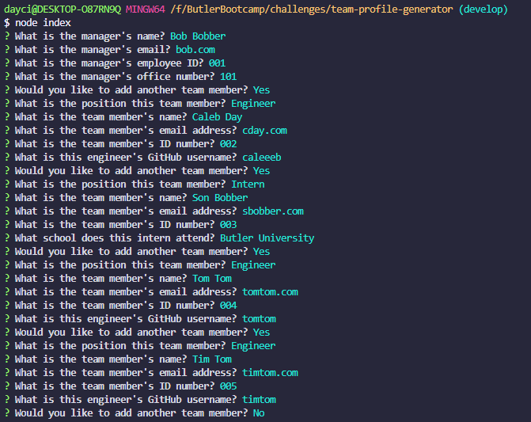
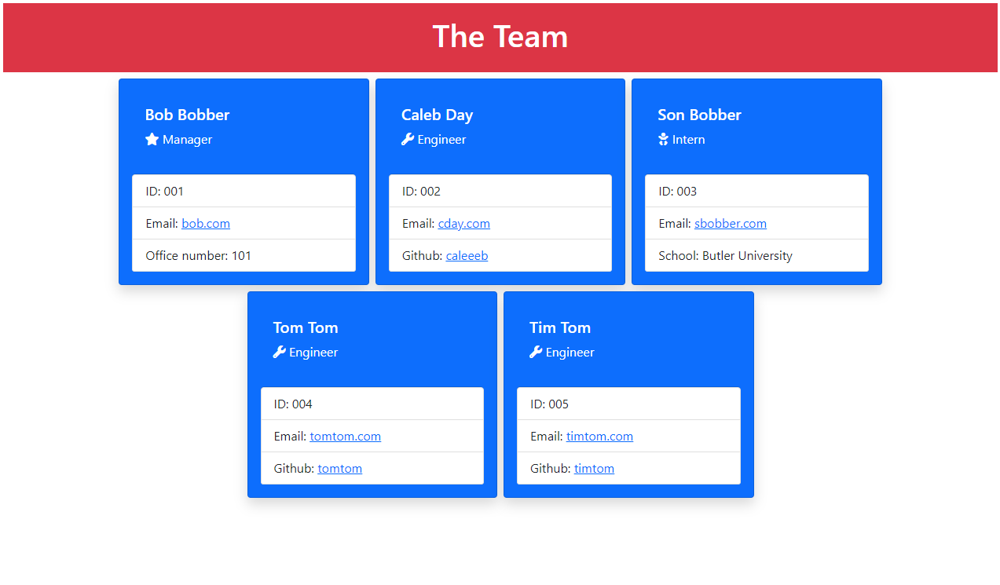

<h1 id='title'> Team Profile Generator </h1>


<h2 id='contents'> Table of Contents </h2>

* [Description](#description)

* [Installation](#installation)

* [Usage](#usage)
 
* [Tests](#tests)

* [Contributors](#technology)

* [Questions](#questions) 

* [MIT License](#license)

<h2 id='description'> Description </h2>

This is an application that will create a webpage that displays a workforce's basic employee information.

video of how to use:

https://drive.google.com/file/d/1R6z1mk-hClhk4VFI5W3X2t0Uq4yLqYLk/view

Visuals:






<p style='text-align: right;'><a href='#title'>Back to top</a></p>


<h2 id='installation'> Installation </h2>

Run these commands to install description:

```
npm i
```

<p style='text-align: right;'><a href='#title'>Back to top</a></p>

<h2 id='usage'> Usage </h2>

The latest version of Node.js is needed. This application will ask you a series of questions in order to create a website with all employee information organized into a thoughtful design. To run this program, use the command: 

```
node index.js
```

<p style='text-align: right;'><a href='#title'>Back to top</a></p>

    
<h2 id='tests'> Tests </h2>
    
Use these commands to run tests:

```
jest
```
    
<p style='text-align: right;'><a href='#title'>Back to top</a></p>
    
<h2 id='technology'> Technology </h2>

- Node.js
- Inquirer.js
- Jest.js
- Bootstrap
- Font Awesome

<p style='text-align: right;'><a href='#title'>Back to top</a></p>

<h2 id='questions'> Questions </h2>

If you have any questions, contact:

daycinematography@gmail.com

<p style='text-align: right;'><a href='#title'>Back to top</a></p>

<h2 id='license'>License</h2>

      Copyright © MIT. All rights reserved.
      
      Lincensed under the MIT license.

<p style='text-align: right;'><a href='#title'>Back to top</a></p>
